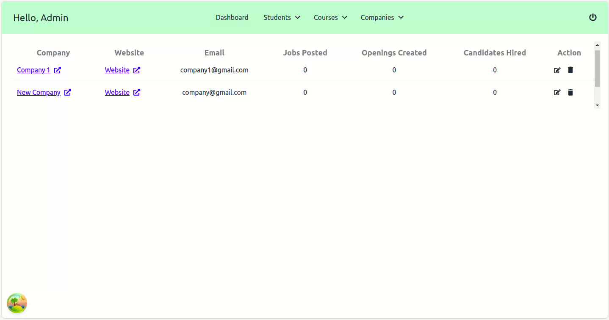

## About the project

- A placement portal for colleges, deployed [here](https://placement-portal-react.netlify.app/).
- Super Admin dashboard to manage companies and students associated with the college.
- Company dashboard to post job openings, view job applications & student profiles and hire/reject candidates.
- Student Dashboard to manage profile, view & apply for available job openings and track application status.

## Backend

Created REST APIs using NodeJS, ExpressJS & MongoDB. \
Postman Collection: [here](https://documenter.getpostman.com/view/20410939/2s93zCYLXJ) \
GitHub Repository: [here](https://github.com/placementportal/placement-portal)

## Snaps

### Admin Dashboard

||
|:--:|
|*Students* |

||
|:--:|
|*Courses* |

||
|:--:|
|*Companies* |

### Company Dashboard

||
|:--:|
|*Job Openings* |

||
|:--:|
|*Job Applications* |

### Student Dashboard

||
|:--:|
|*Student Profile* |

||
|:--:|
|*Student Jobs* |